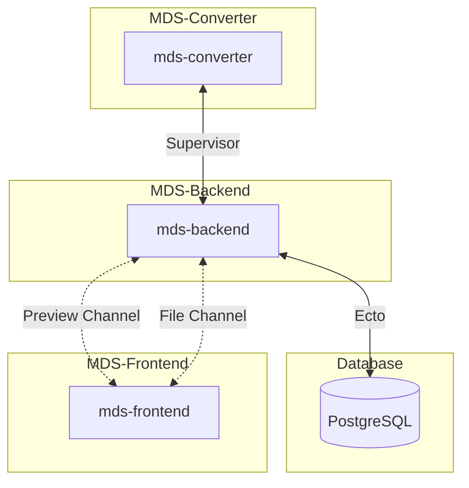

# **Markdown Docs Collaborative Editor** 🚀

A powerful, real-time collaborative Markdown editor inspired by Google Docs and Overleaf. Built with **React**, **Phoenix**, and **Haskell**, this project brings team-based editing to the next level with custom `.mds` format support, Unsplash image embeds, and live synchronization.

---

### **Demo Preview** 🎥

https://github.com/user-attachments/assets/79bc1bef-a84f-4baa-a86f-b2fb396f7586


## **Key Features** 🌟

- **Real-Time Collaboration**:  
- [x] Edit Markdown documents with your team simultaneously. See edits in real-time near instantly!

- **Custom `.mds` Format**:  
  Extend Markdown with powerful features:
  - [x] `!![Your Title]`: Add beautiful document titles.  
  - [ ] WIP:
    - [ ] `!gif[search term]`: Embed GIFs on the fly.  
    - [ ] `!image[unsplash term]`: Seamlessly add images from Unsplash.  

- **Live Preview**:  
- [x] Instantly preview Markdown-rendered content as you type.

- **Unsplash Integration**:  
- [ ] Quickly embed stunning, royalty-free images.

- **History Tracking**:  
- [ ] Built-in undo/redo functionality.

---

## **Tech Stack** ⚙️

| **Component**   | **Technology**                           |
|------------------|------------------------------------------|
| **Frontend**     | [React](https://reactjs.org/), [CodeMirror](https://codemirror.net/), [react-markdown](https://github.com/remarkjs/react-markdown), [phoenix](https://www.npmjs.com/package/phoenix) |
| **Backend**      | [Elixir](https://elixir-lang.org/) + [Phoenix Framework](https://www.phoenixframework.org/) |
| **Parser**       | [Haskell](https://www.haskell.org/) + [Pandoc](https://pandoc.org/) |
| **Database, ORM**     | [PostgreSQL](https://www.postgresql.org/), [Ecto](https://github.com/elixir-ecto/ecto)                              |
| **APIs**         | [Unsplash API](https://unsplash.com/developers) |

---

## **Usage** 📖

### 1. **Collaborative Editing**
- Share your document with team members. All changes are synchronized in real-time.

### 2. **Using `.mds` Features**
- Add titles:
  ```markdown
  !title[My Document Title]
  ```
- Embed a GIF:
  ```markdown
  !gif[coding cat]
  ```
- Add an Unsplash image:
  ```markdown
  !image[forest]
  ```

---

## **Project Structure** 📂

```plaintext
markdown-docs/
├── msd-frontend/        # React frontend
├── mds-backend/         # Elixir Phoenix backend
├── mds-parser/          # Haskell-based .mds parser
└── mds-docs/            # Project documentation
```



---

## **Contributing** 🤝

We're welcome to contributions! But only in the form of requested features in the form of 'issues' 👼  
Feel free to request any feature you won't in the `mds-backend`, `mds-frontend` or `mds-parser` repos

---

## **Roadmap** 🛤️

- [x] Basic Markdown editor with live preview.  
- [x] Real-time collaboration with WebSocket support.  
- [x] Custom `.mds` parser in Haskell.
- [x] File storage on backend
- [x] Rest API for downloading / loading files
- [x] Haskell Parser integration & separate sockets for preview & context 
- [ ] Unsplash API integration.  
- [ ] Export to PDF.
- [ ] Mobile-friendly UI.  

---

## **License** 📜

This project is licensed under the [Apache License 2.0](LICENSE).  

---

## **Contributors** ✨

- **[Boris Dvorkin](https://github.com/worthant)**: Lead Developer, DevOps Engineer, Fullstack Engineer (Elixir and React)  
- **[Alexander Razinkin](https://github.com/DecafMangoITMO)**: Fullstack Engineer (Elixir and React)  
- **[Roman Kobelev](https://github.com/Romariok)**: Fullstack Engineer (Elixir and React)  
- **[Artem Sorokin](https://github.com/ta4ilka69)**: Software Engineer (Haskell)

---

For questions or feedback, feel free to [open an issue](https://github.com/Imtjl/markdown-docs/issues).  
